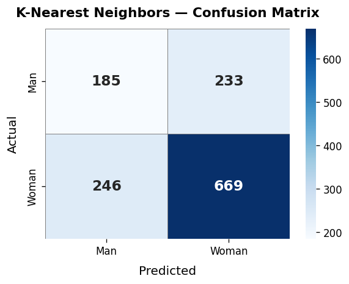
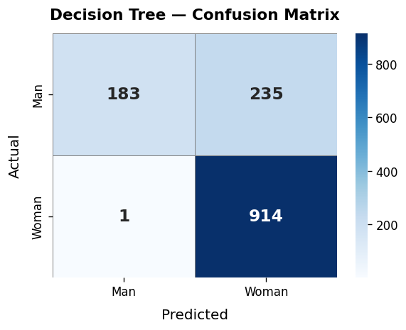
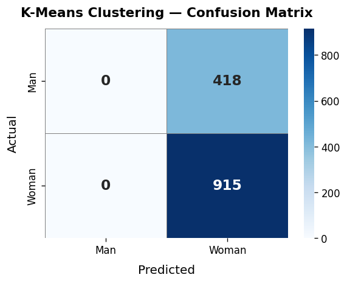
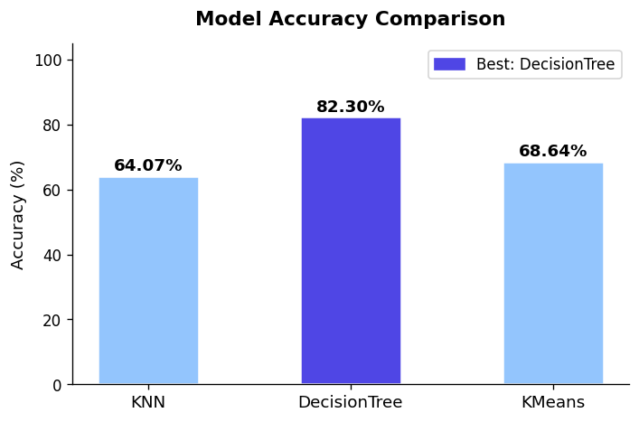

# Gender Classification ML — Assignment 2

A binary gender classification system that applies **KNN**, **Decision Tree**, and **K-Means Clustering** to a labeled face image dataset, evaluates each model with confusion matrices, compares their performance, and serves predictions through a **Flask web interface**.

---

## Results

| Algorithm | Type | Accuracy |
|---|---|---|
| 🏆 **Decision Tree** | Supervised | **82.30%** |
| K-Means Clustering | Unsupervised | 68.64% |
| KNN (k=5) | Supervised | 64.07% |

**Best Model: Decision Tree** — achieves the highest accuracy on the test set.

### Confusion Matrices

| KNN | Decision Tree | K-Means |
|---|---|---|
|  |  |  |

### Accuracy Comparison Chart



---

## Project Structure

```
ASSIGNMENT 2/
├── app.py                  # Flask web application
├── train.py                # Full training pipeline
├── generate_charts.py      # Regenerate charts from saved report
├── requirements.txt        # Python dependencies
├── src/
│   ├── data_loader.py      # Image loading & label assignment
│   ├── preprocessor.py     # Resize 64×64, RGB, normalize [0,1]
│   ├── feature_extractor.py# Flat (12288-dim) feature extraction
│   ├── models.py           # KNN, Decision Tree, K-Means wrappers
│   ├── evaluator.py        # Accuracy, confusion matrix, comparison
│   └── persistence.py      # joblib save/load utilities
├── templates/
│   ├── index.html          # Upload form + model stats
│   ├── result.html         # Prediction result page
│   └── comparison.html     # Full model comparison dashboard
├── static/
│   ├── style.css           # UI styles
│   ├── cm_knn.png          # KNN confusion matrix
│   ├── cm_dt.png           # Decision Tree confusion matrix
│   ├── cm_kmeans.png       # K-Means confusion matrix
│   └── comparison_chart.png# Accuracy bar chart
└── models/                 # Saved model artifacts (generated by train.py)
    ├── knn_model.joblib
    ├── dt_model.joblib
    ├── kmeans_model.joblib
    ├── best_model.joblib
    ├── extractor_config.json
    └── report.json
```

---

## Dataset

- **Training:** `DATA/traindata/traindata/men/` (1000 images) + `women/` (1912 images) = **2912 total**
- **Test:** `DATA/testdata/testdata/men/` (418 images) + `women/` (915 images) = **1333 total**
- **Supported formats:** `.jpg`, `.jpeg`, `.png`, `.gif`
- **Labels:** `0` = Man, `1` = Woman

> The `DATA/` folder is **not included** in this repo due to size. Place it at `~/Downloads/DATA/` before training.

---

## Setup & Usage

### 1. Install dependencies

```bash
pip install -r requirements.txt
```

### 2. Train all models

```bash
python train.py
```

This will:
- Load and preprocess all images
- Extract flat pixel features (64×64×3 → 12288-dim vector)
- Train KNN, Decision Tree, and K-Means
- Print accuracy + confusion matrix for each
- Save model artifacts to `models/`
- Generate confusion matrix images and comparison chart to `static/`

### 3. Start the Flask web app

```bash
python app.py
```

Open **http://127.0.0.1:5001** in your browser.

---

## Web Interface

### Home Page — Upload & Predict
- Shows accuracy scorecards for all 3 models
- Drag-and-drop image upload
- Predicts using the best-performing model (Decision Tree)

### Comparison Page (`/comparison`)
- Ranked accuracy table with progress bars
- Accuracy bar chart
- All 3 confusion matrices side by side
- Algorithm descriptions and dataset stats

### Result Page
- Displays predicted gender (Man / Woman) with emoji
- Shows which model made the prediction and its accuracy

---

## Algorithms

### K-Nearest Neighbors (KNN)
- Classifies by majority vote among the **5 nearest** training samples (Euclidean distance)
- Accuracy: **64.07%**

### Decision Tree
- Recursively splits features using information gain
- Interpretable, fast at inference
- Accuracy: **82.30%** ← Best

### K-Means Clustering
- Unsupervised — groups images into 2 clusters
- Cluster-to-label mapping via majority vote on training labels
- Accuracy: **68.64%**
- Note: sensitive to class imbalance (women outnumber men ~2:1)

---

## Feature Extraction

Images are resized to **64×64 pixels**, converted to RGB, normalized to `[0, 1]`, then **flattened** into a 12,288-dimensional feature vector fed into each model.

---

## Tech Stack

| Library | Purpose |
|---|---|
| `scikit-learn` | KNN, Decision Tree, K-Means, metrics |
| `Pillow` | Image loading & preprocessing |
| `NumPy` | Array operations |
| `Flask` | Web interface |
| `joblib` | Model serialization |
| `matplotlib` + `seaborn` | Confusion matrix & chart plots |

---

## Author

**Musab** — Assignment 2, Gender Classification using Machine Learning
